# Rizlium Editor Crate 依赖关系分析

## 文件依赖关系 Mermaid 图

```mermaid
graph TD
    %% 主要入口文件
    main[main.rs] --> lib[lib.rs]
    
    %% lib.rs 依赖的核心模块
    lib --> editor_actions[editor_actions.rs]
    lib --> extensions[extensions.rs]
    lib --> project[project.rs]
    lib --> settings_module[settings_module.rs]
    lib --> time_and_audio[time_and_audio.rs]
    lib --> ui[ui.rs]
    lib --> utils[utils.rs]
    
    %% main.rs 依赖的模块
    main --> project
    main --> settings_module
    main --> time_and_audio
    main --> extensions
    
    %% editor_actions.rs 的依赖
    editor_actions --> project
    editor_actions --> time_and_audio
    
    %% extensions.rs 的子模块
    extensions --> command_panel[extensions/command_panel.rs]
    extensions --> docking[extensions/docking.rs]
    extensions --> editing[extensions/editing.rs]
    extensions --> game[extensions/game.rs]
    extensions --> explorer[extensions/explorer.rs]
    extensions --> i18n[extensions/i18n.rs]
    extensions --> inspector[extensions/inspector.rs]
    extensions --> debug_flycam[extensions/debug_flycam.rs]
    
    %% command_panel.rs 的依赖
    command_panel --> lib
    
    %% docking.rs 的依赖
    docking --> ui
    docking --> settings_module
    
    %% editing.rs 的依赖
    editing --> project
    editing --> world_view[extensions/editing/world_view.rs]
    editing --> note[extensions/editing/note.rs]
    editing --> spline[extensions/editing/spline.rs]
    editing --> timeline[extensions/editing/timeline.rs]
    editing --> tool_config_window[extensions/editing/tool_config_window.rs]
    editing --> tool_select_bar[extensions/editing/tool_select_bar.rs]
    editing --> undo_redo[extensions/editing/undo_redo.rs]
    
    %% world_view.rs 的依赖
    world_view --> project
    world_view --> tools[extensions/editing/world_view/tools.rs]
    world_view --> cam_response[extensions/editing/world_view/cam_response.rs]
    
    %% game.rs 的依赖
    game --> project
    game --> time_and_audio
    game --> explorer
    
    %% explorer.rs 的依赖
    explorer --> project
    
    %% ui.rs 的子模块
    ui --> theme[ui/theme.rs]
    ui --> widgets[ui/widgets.rs]
    
    %% widgets.rs 的子模块
    widgets --> dock_buttons[ui/widgets/dock_buttons.rs]
    widgets --> recent_file_buttons[ui/widgets/recent_file_buttons.rs]
    widgets --> shortcut_display[ui/widgets/shortcut_display.rs]
    
    %% 外部crate依赖
    lib -.-> rizlium_render["rizlium_render crate"]
    lib -.-> helium_framework["helium_framework crate"]
    lib -.-> bevy["bevy crate"]
    lib -.-> egui["egui crate"]
    
    project -.-> rizlium_chart["rizlium_chart crate"]
    project -.-> rizlium_render
    time_and_audio -.-> rizlium_render
    
    %% 样式定义
    classDef mainFile fill:#e1f5fe,stroke:#01579b,stroke-width:2px
    classDef coreModule fill:#f3e5f5,stroke:#4a148c,stroke-width:2px
    classDef extensionModule fill:#e8f5e8,stroke:#1b5e20,stroke-width:2px
    classDef uiModule fill:#fff3e0,stroke:#e65100,stroke-width:2px
    classDef externalCrate fill:#ffebee,stroke:#b71c1c,stroke-width:2px
    
    %% 应用样式
    class main,lib mainFile
    class editor_actions,extensions,project,settings_module,time_and_audio,utils coreModule
    class command_panel,docking,editing,game,explorer,i18n,inspector,debug_flycam,world_view,note,spline,timeline,tool_config_window,tool_select_bar,undo_redo,tools,cam_response extensionModule
    class ui,theme,widgets,dock_buttons,recent_file_buttons,shortcut_display uiModule
    class rizlium_render,helium_framework,bevy,egui,rizlium_chart externalCrate
```

## 依赖关系分析总结

### 核心架构

rizlium_editor crate采用了模块化的架构设计，主要包含以下几个核心部分：

1. **入口层**：
   - [`main.rs`](rizlium_editor/src/main.rs:1) - 应用程序入口点，负责初始化所有插件和系统
   - [`lib.rs`](rizlium_editor/src/lib.rs:1) - 库的主入口，定义了核心结构和UI系统

2. **核心功能模块**：
   - [`editor_actions.rs`](rizlium_editor/src/editor_actions.rs:1) - 编辑器动作和命令系统
   - [`project.rs`](rizlium_editor/src/project.rs:1) - 项目管理和图表加载/保存
   - [`settings_module.rs`](rizlium_editor/src/settings_module.rs:1) - 设置模块系统
   - [`time_and_audio.rs`](rizlium_editor/src/time_and_audio.rs:1) - 时间控制和音频管理
   - [`utils.rs`](rizlium_editor/src/utils.rs:1) - 工具函数

3. **扩展系统**：
   - [`extensions.rs`](rizlium_editor/src/extensions.rs:1) - 扩展管理器，统一管理所有扩展
   - 各种子扩展模块：
     - [`command_panel.rs`](rizlium_editor/src/extensions/command_panel.rs:1) - 命令面板
     - [`docking.rs`](rizlium_editor/src/extensions/docking.rs:1) - 停靠系统
     - [`editing.rs`](rizlium_editor/src/extensions/editing.rs:1) - 编辑功能
     - [`game.rs`](rizlium_editor/src/extensions/game.rs:1) - 游戏视图
     - [`explorer.rs`](rizlium_editor/src/extensions/explorer.rs:1) - 文件浏览器

4. **UI系统**：
   - [`ui.rs`](rizlium_editor/src/ui.rs:1) - UI核心系统
   - [`theme.rs`](rizlium_editor/src/ui/theme.rs:1) - 主题定义
   - [`widgets.rs`](rizlium_editor/src/ui/widgets.rs:1) - UI组件

### 依赖关系特点

1. **分层架构**：依赖关系呈现清晰的分层结构，从入口层到核心模块，再到扩展和UI组件。

2. **模块化设计**：各个模块职责明确，通过良好的接口进行交互，降低了耦合度。

3. **扩展性**：通过extensions系统，可以方便地添加新功能而不影响核心代码。

4. **外部依赖**：主要依赖了几个关键的外部crate：
   - `rizlium_render` - 渲染系统
   - `rizlium_chart` - 图表数据处理
   - `helium_framework` - 框架基础设施
   - `bevy` - 游戏引擎
   - `egui` - UI库

### 关键依赖路径

1. **主执行流**：`main.rs` → `lib.rs` → 各核心模块 → 扩展系统 → UI组件

2. **项目处理流**：`project.rs` ← `editor_actions.rs` ← `game.rs`/`explorer.rs`

3. **渲染流**：`world_view.rs` → `rizlium_render` ← `time_and_audio.rs`

4. **UI渲染流**：`lib.rs` → `ui.rs` → `theme.rs`/`widgets.rs`

这种架构设计使得rizlium_editor具有良好的可维护性和扩展性，各个模块之间的依赖关系清晰，便于理解和修改。